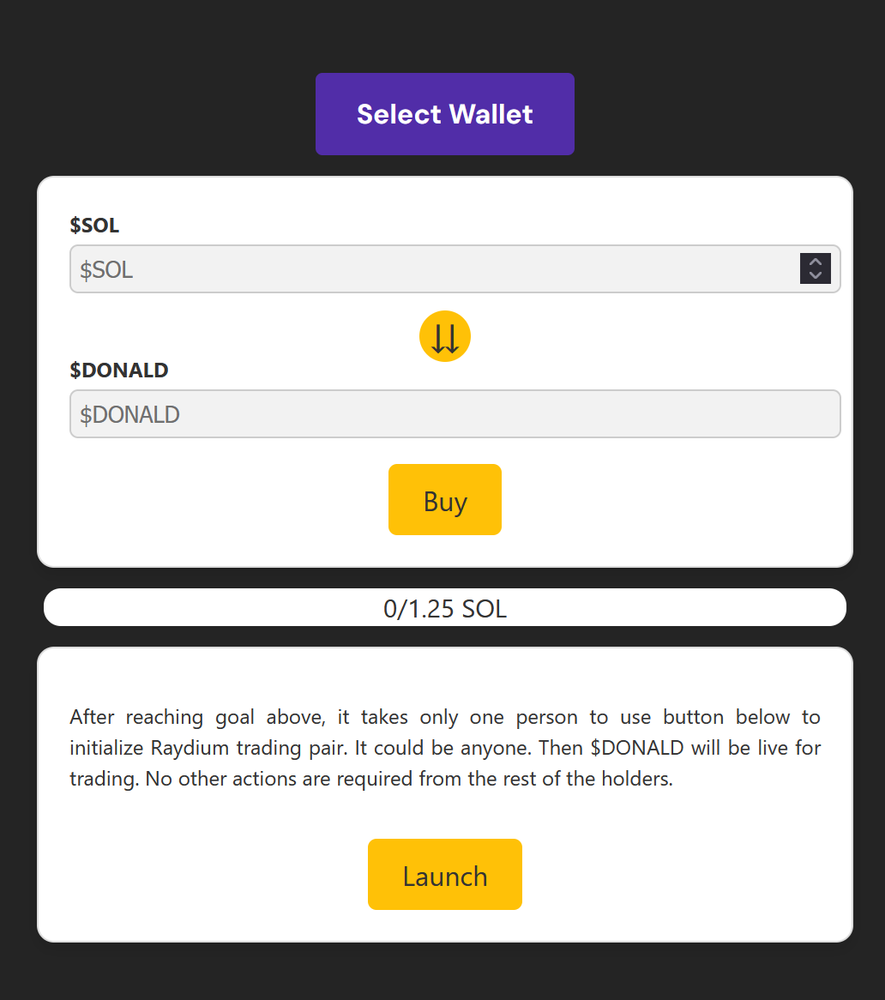

# Solana FairLaunch

[](https://opensource.org/licenses/MIT)
[](https://solana.com/)
[](https://www.anchor-lang.com/)

**Decentralizované a bezpečné riešenie pre spúšťanie tokenov na sieti Solana.** Tento protokol rieši najväčší problém krypto-investícií: bezpečnosť a dôveru. Developer nemá prístup k vyzbieraným prostriedkom, kým nie je naplnený cieľ a zabezpečená likvidita.

---

## 🖼️ Ukážka projektu


*Ukážka používateľského rozhrania pre nákup a predaj v rámci presale.*

---

## ✨ Kľúčové Funkcionality

* **🔒 Trustless Escrow:** Všetky SOL investované počas presale sú spravované smart kontraktom (Program Derived Address). Nikto, ani vývojár, ich nemôže vybrať manuálne.
* **⚡ Automatické kótovanie (Raydium):** Po dosiahnutí cieľovej sumy (Hard Cap) môže ktokoľvek zavolať funkciu na uvoľnenie likvidity priamo do Raydium DEX.
* **🛡️ Investor Refund System:** Ak sa nevyzbiera cieľová suma, investori môžu svoje tokeny kedykoľvek predať späť kontraktu za pôvodnú cenu (v SOL).
* **💎 Fair Distribution:** Žiadne "insider" tokeny – distribúcia prebieha na základe vkladov komunity.

---

## 🛠️ Technický Stack

### Smart Contract (Backend)
- **Rust** & **Anchor Framework**
- **Solana Web3.js** pre komunikáciu s blockchainom.
- Implementácia logiky pre **PDA (Program Derived Addresses)** na izoláciu prostriedkov.

### Frontend
- **React.js** (Next.js)
- **Tailwind CSS** pre moderný dizajn.
- **@solana/wallet-adapter** pre integráciu s Phantom, Solflare a inými peňaženkami.

---

## ⚙️ Logika Protokolu

1.  **Vytvorenie Presale:** Admin inicializuje kontrakt s parametrami: Soft Cap, Hard Cap, cena tokenu a trvanie.
2.  **Investičná fáza:** Používatelia posielajú SOL a dostávajú presale tokeny. SOL sa hromadí v escrow účte kontraktu.
3.  **Ukončenie:**
    * **Success:** Ak je Hard Cap dosiahnutý, kontrakt odomkne funkciu na vytvorenie Liquidity Poolu na Raydium.
    * **Fail/Refund:** Kým nie je splnený cieľ, používateľ môže vyvolať funkciu `sell_back`, vrátiť tokeny a získať svoje SOL späť.

---

## 🚀 Inštalácia a Spustenie

### Prerekvizity
* Rust & Cargo
* Solana CLI
* Anchor Framework
* Node.js & npm/yarn

### 1. Smart Contract
```bash
# Prechod do priečinka s kontraktom
cd program

# Build kontraktu
anchor build

# Spustenie testov
anchor test
